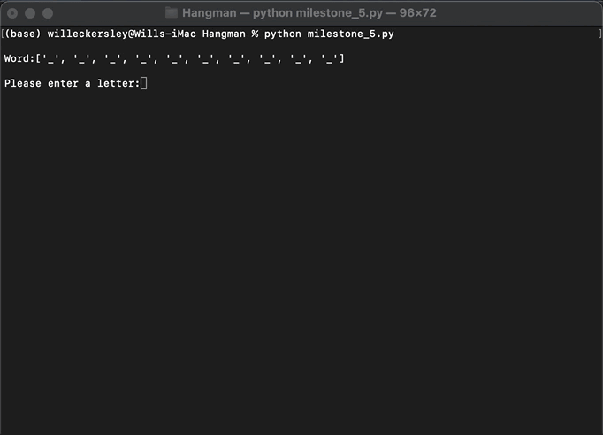
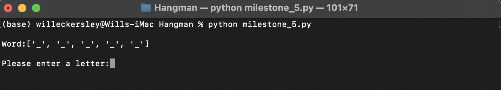
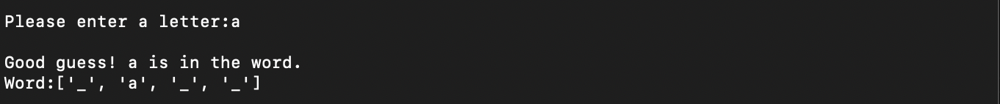
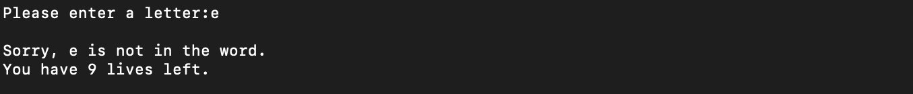
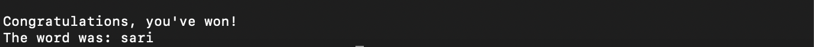
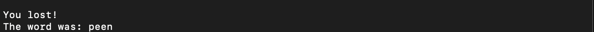

# Hangman
My build of the classic game "Hangman".

### Description
Hangman is a classic game where the player tries to discover a mystery word using a mixture of guesswork and deduction. Traditionally, two human players play against each other. However, in this version, a single human player plays against a computer. 

### Walkthrough

The game begins with the player being presented with a series of dashes and a request to enter a letter:

Each dash represents a letter in the unknown word. The player then has a predetermined number of chances (a.k.a lives) to suggest letters that might be in the word. In this version of the game, the player has 10 lives. 

If the player suggests a letter that appears in the word, two things happen. First, a message of congratulation is printed. Second, the position(s) occupied by the letters in the word are updated from '_' to the successful suggestion:

If the player suggests a letter that appears more than once in the word, e.g. 'apple' where the letter 'p' appears twice, then every dash representing the position occupied by that letter is filled in. The player does not have to guess the same letter more than once to confirm that it does not reappeaer in the word.   

If the player suggests a letter that is not in the word, a message of comiseration and the number of remaining lines are printed:

If the player successfuly discovers every letter that appears in the word before running out of lives then a message of congratulation is printed alongside the mystery word:

If the player's lives reach 0 then the game prints a message of comiseration and reveals the mystery word:

This game accepts only alphabetical characters. If the player attempts to re-enter a letter they have already attempted then the game will print a message indicating that the letter has already been used.

### Instilation

This version of hangman can be run on any computer with Python 3.11.3 or above. It has [wonderwords](https://github.com/mrmaxguns/wonderwordsmodule) as a depdendancy. 

### License

Licensed under the unlicense. 